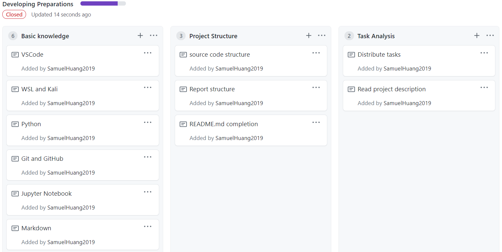
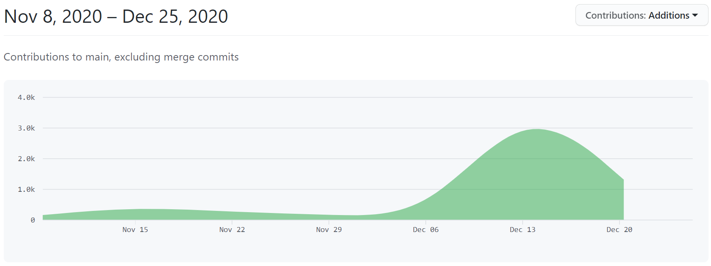
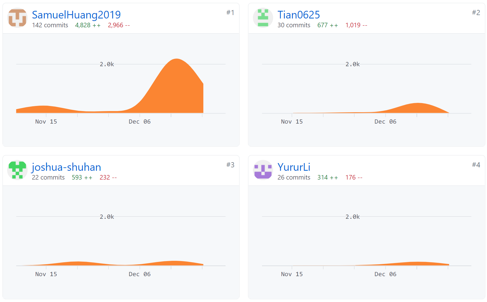

# Project Management and Contributions

- HUANG Guanchao, SID 11912309 from SME
  - organizing the project team, work scheduling
  - `Matrix` data structure implementing
  - conducting algorithm test
  - experiment data analysis
  - [Empirical Analysis](#empirical-analysis) and [Conclusion](#conclusion) part of report
  - creating PowerPoint slides, and delivered presentation on class
  - final adjust of the report
  - the [repository of this project](https://github.com/SamuelHuang2019/dsaa-projec-matrix) is under his GitHub account [SamuelHuang2019](https://github.com/SamuelHuang2019)

- ZHENG Shuhan, SID 11712401 from PHY
  - reading the paper, and offering theoretical instructions on adaptive Strassen's algorithm for us
  - `Matrix` data structure implementing
  - implementing two methods of multiplication, including function `square_matrix_multiply`, `adaptive_add`, `adaptive_minus` and `strassen_multiply`
  - [Code Implementation](#experiment-design) part of the report

- LI Yuru, SID 11911035 from EIE
  - [Introduction](#introduction) and [Theoretical Analysis](#theoretical-analysis) part of the report

- -TIAN Yuqiong, SID 11911039 from EIE
 [Background](#background) and [Theoretical Analysis](#theoretical-analysis) part of the report

>SPECIAL THANKS TO:
>
> - SUN Jiachen, who provided testing platform for us.
> - HAN Zichen, who offered us professional advice on Python and other CS problems.

Our project is based on GitHub for version control and code cooperation, on which we created projects for different stages of our work.

Also, we opened some issues while code debugging.

Until December 25th, 2020, the contributions insight is as shown below.

